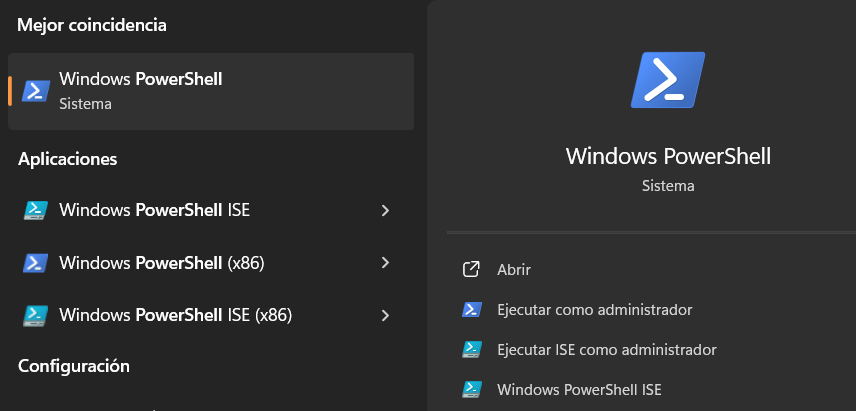
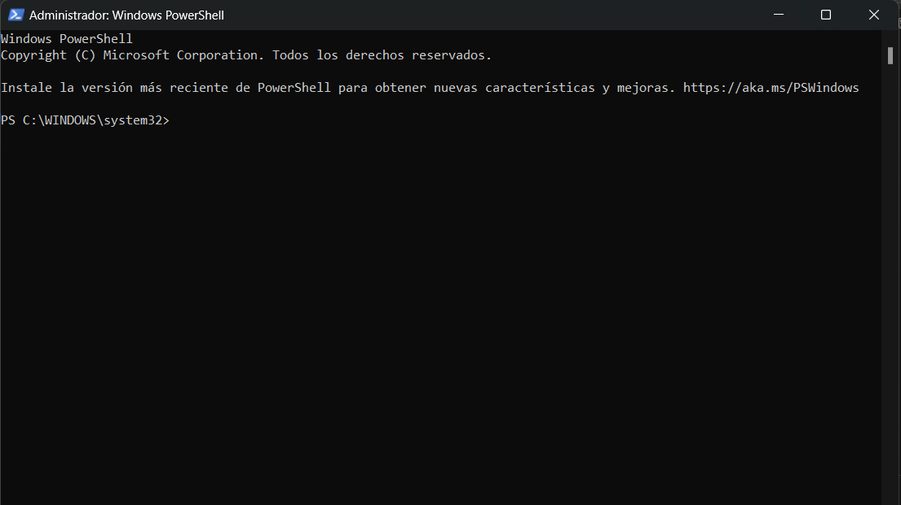
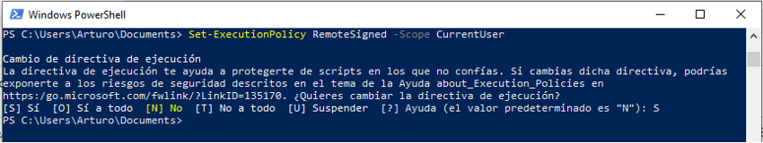

# Proyecto de estadistica Crecer Bien


---
Felipe González Poblete

felipe.gonzalez@crecerbien.cl
---

Este proyecto consiste en el uso de algunas librerias de Python y la recopilación de los logros del sistema de agendas [Reservo](https://reservo.cl). El objetivo principal de este proyecto es medir de manera correcta y fidedigna el rendimiento de los recepcionistas.

Esto es logrado mostrando los graficos de la "velocidad de agendamiento", es decir, la cantidad de citas creadas, dividido por los días trabajados:

$$
VelocidadDeAgendamiento= \frac{citasCreadas}{DiasTrabajados}
$$

Por el momento este proyecto solamente funciona en Windows, ya que es la forma que fue desarrollada para que se pueda ejecutar un programa que instale todo por su propia cuenta. Sin embargo, se puede hacer algunos ajustes para que funcione en Ubuntu o en MacOS.

## Prerrequisitos (Windows)

Primeramente, se debe verificar que el [script de instalación](Configuracion.ps1) se pueda ejecutar, esto puede ser realizado de la siguiente manera:

### Abrir PowerShell como Administrador:

Para lograr esto, debes:

- Pulsar al mismo tiempo las teclas Windows + S lo que abrirá un cuadro de búsqueda

- Escribir "Powershell"



Aparecerá en el cuadro de búsqueda unos resultados de este estilo, por lo que debes pinchar en "Ejecutar como administrador". Aparecerá una ventana y debes seleccionar "Si"

Después de hacer esto, aparecerá una ventana que será similar a esta:



Despues de esto debes pegar este código en la terminal:

```powershell
Set-ExecutionPolicy Unrestricted -Scope CurrentUser
```

Va a preguntarte algo similar a lo que aparezca en la imagen siguiente:



A lo que debes ingresar la letra 'O' (la letra o de Ornitorrinco)

Ahora se puede cerrar la terminal y continuar con la ejecución del script

Luego, debes ir a la carpeta principal y buscar el script llamado ["configuracion"](Configuracion.ps1), para luego hacer click derecho sobre él y poner "Ejecutar con powershell".

## Ejecución del código.

Para poder ejecutar el código, se deben tener en cuenta 2 cosas:

1. Que archivo hay que ejecutar
2. La forma que se deben ingresar los datos de agendamiento

Lo bueno es que ya se puede ejecutar el script de manera inmediata luego de 